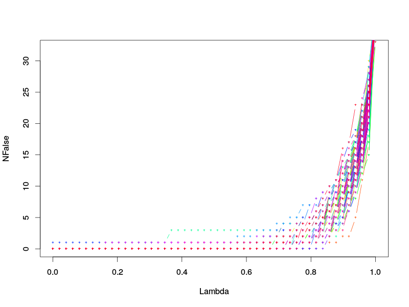
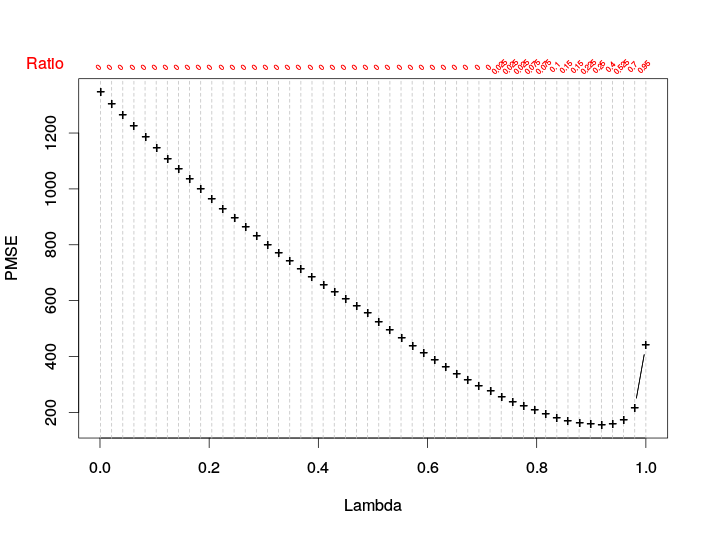

optimise2
=========

The optimise(stat) in R sometimes fails to converge to global optimization point. In fact, in GSL, most of these cases will report a warining message. The rule in this packages is gsl_min_fminimizer_quad_golden with more than one guess.

    Dependencies: Rcpp RcppGSL

In fact, this package may only depend on libgsl. I fail to configure it on windows if Cygwin is not used.

Some c functions are modifications of survival/base. 

Installation
------------

On Linux/Mac you may simply use

```r
library(devtools)
install_github('yfyang86/optimise2')
```

On windows, due to CRAN uses a strange path, you have to do the following

 1. Create a folder `D:\RCompile\CRANpkg\extralibs64\local` (R-3.2.X uses `C:\applications\extsoft`)    
 2. Download [GSL MSVC 10](http://www.icub.org/download/packages/windows/msvc10/gsl-1.14-bin-msvc10.zip) and unzip it to previous path(R-3.2.X uses [GSL-1.15-dev-win64](https://oscats.googlecode.com/files/gsl-1.15-dev-win64.zip))    
 3. Then your path include

 ```batch
 D:\RCompile\CRANpkg\extralibs64\local
 ├───include
 └───lib
 ```
 The you can install using devtools like Mac/Linux users do.

 Example
---------------

### optimise2

```r
f <- function(x) sin(x^2) + x/10
optimise(f, c(1, 4), tol = 1e-06)
optimise(f, c(1.5, 11))  # WRONG!!!
optimise2(f, c(1.5, 11), tol = 1e-06)
```

### Lambda Selection

 ```r
 set.seed(65535)
 Xmat = matrix(rnorm(100*80),ncol=80)
 beta0 = rnorm(80,sd=2)
 beta0[sample(1:80,70)] = 0.
 epsilon = rnorm(100)
 Yvec = Xmat%*%beta0 + epsilon
 lambdas = seq(from=.001,to=1,length.out=50) # a vec
 lambda_Select(Yvec,Xmat)
 ```

Example:

 ```r    
 library(optimise2)
 N = 100
 p = floor(N*.8)
 q = p/(1:2)
 ratio = c(.05,.1,.2)
 qi=2
 ri=1
 ## iid case
 SIMU=100
 RE = numeric(SIMU)
 for (simu in 1:SIMU){
   Xmat = matrix(rnorm(N*p),ncol=p)
   beta0 = rnorm(p,sd=2)
   ind.zero = sample(1:p,floor(p*0.9))
   ind.nzero = (1:p)[-ind.zero]
   beta0[ind.zero] = 0. # 90% beta <- 0
   epsilon = rnorm(N)
   Xmat  = t(t(Xmat) - apply(Xmat,2,mean))
   Yvech = Xmat%*%beta0 + epsilon
   Yvec = Yvech - mean(Yvech)
   
   lambda_Select(Yvec,Xmat,nPsep = q[qi], perc = ratio[ri]) -> re
   uuz <- (abs(re$result$beta[,sum(re$selection)] )>1e-14)
   RE[simu] = sum((ind.nzero) %in% which(uuz))/sum(uuz)
   cat(simu,'-th RE: ',RE[simu],'\n')
   if (simu==1)plot(summary(re)[-2],type='b',col=rainbow(SIMU)[simu],pch='+',cex=.5,ylim=c(0,q[qi]*.8))
   points(summary(re)[-2],type='b',col=rainbow(SIMU)[simu],pch='+',cex=.5,ylim=c(0,q[qi]*.8))
 }
 summary(RE)
 #abline(h=length(ind.nzero),lty=2,col=2)
 ```

 

Test on verification set:

 
 

### Linear Model with $H_0: c^\top \beta = c_0$
 
 ```r
 # Example 1: dim =1
 x=seq( 0,10,0.1) 
 y = matrix( 6*x+7+runif( 101,min=-1,max=1) ,ncol=1) 
 x=matrix( x,ncol=1) 
 re = lmconst( y,x,2,19) 
 re
 re[ 1] +2*re[ 2] 
 
 # Example 2: multi dim
 x = matrix(runif(100),ncol=2) 
 y = x %*% c(6,2) +1 + rnorm( 50) 
 re = lmconst(y=y,x=x,x0=c(2,1),y0=15) 
 re
 re[1] +2*re[2] +re[ 3] 
 ```

### Global Optimise: GSL routine

 ```r
 f <- function(x) sin(x^2) + x/10
 optimise(f, c(1, 4), tol = 1e-06)
 optimise(f, c(1.5, 11))  # WRONG!!!
 optimise2(f, c(1.5, 11), tol = 1e-06)
 ```
